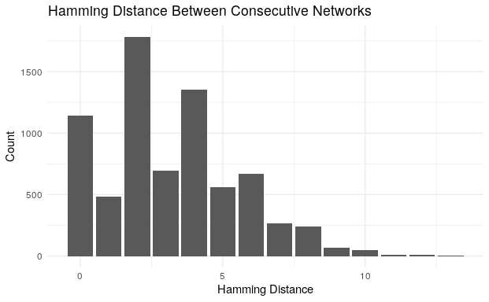

```{r setup, include=FALSE}
knitr::opts_chunk$set(echo = FALSE)
```

# Introduction 

Our project studies the network of eye contact made by players of the party game, “Resistance”. In the game, players are assigned one of two classes: resistance or spy. All spies know each other and attempt to appear as resistance members, while the resistance players do not know the roles of other players and must figure those out. The game involves deception and much spirited group discussion. 

The dataset comes from a study on predicting visual focus from videos. The goal of the previous study was to predict people’s visual focus of attention by implementing an ICAF (Iterative Collective Attention Focus) model. This is a collective classification model that jointly learns the visual focus of attention of all people involved where each person is modeled with a different classifier. Their fitted ICAF is given a training video up to time t and then is programmed to be able to predict where each person is going to look at the next timestamp, t + 1/3. using inter-person dependencies and temporal consistency. The ICAF model was fit to a 5 video dataset of people playing “The Resistance Game.”  The model performed between 1%-5% better than the strongest baseline. 

While the previous study performed by students at Stanford and Dartmouth focused on creating a specific model that predicts the visual focus of attention, we aim to make conclusions and inferences about the visual behaviors of our population. We’re using a sample of people playing the Resistance game to represent average people participating in normal discussion. Our research objective is to determine if eye contact is more likely reciprocated than not. That is, if one player makes eye contact with another player, does it become more likely the eye contact is returned?


# Methodology 

The dataset used in the study was 109 minute video of 5 episodes of the Resistance Game in 3 different countries with 35 people. In the video, they value a “ground truth” of observed visual focus of attention for each person in 1⁄3 second intervals. There are 10 frames in each 1⁄3 second interval, and in capturing this “ground truth,” an expert assigns a label for each person in each 10 frame intervals. A label is assigned if the person looks at the object (either one of the other people in the game or laptop in front of them) for the majority of the 10 frames. 

We are given a total of 62 datasets, where each file represents a round of discussion within a certain instance of the resistance game. In the data, we have two types of adjacency matrices: binary and weighted. In any given round of discussion each row represents a timestamp within the round. Each row also has its own adjacency matrix for that timestamp. The binary matrices indicate whether a player is looking at each object (player or laptop) or not. Because we are researching how people reciprocate visual focus in these rounds of discussion, we have removed the laptop node in the adjacency matrices as it is unable to reciprocate any tie that is connected to it and thus it may skew our results. There is also a weighted version of each binary matrix where each weight is the probability calculated from the original study model. This is not used for the purposes of our own study. 

To study longitudinal network data, we make use of a Stochastic Actor-Oriented Model (SAOM). We chose this model due to its ability to incorporate the timestamp component of our data. For simplicity and computational reasons, we only use the network corresponding to the first round of playing, called “network0”. This dataset involves seven players over 7323 timesteps, where each step represents a third of a second in the original recorded video file. The SAOM computes rate functions for each timestep, as well as objective functions which comprise of several “behavioral” effects, including reciprocity and the presence of 3-cycles. Since there is no covariate data (ex. player attributes), we do not use any covariate-related effects. 
 
The parameter estimation simulation took about 15 minutes to run on a decently powerful laptop.

# Exploratory Visualizations 


The visualization in figure 1 shows the networks of the first 6 timesteps. This correlates to 2 seconds in the original video of the game as each timestamp is divided into 1/3 second intervals. There is some continuity over the time span, such as player 1 not looking at any other player, and there is some change, such as player 4 changing from looking at player 6 to no player. Ideally there is some continuity between timesteps, since otherwise the model may not simulate correctly. Note that each player has their own laptop and that every player looks at exactly one other player or their own laptop (this applies for all timesteps), but for the purposes of this study, we have removed the laptop node, as it is unable to reciprocate any of the ties.  




To visualize network change over time, the distribution of Hamming distance between consecutive networks at time t and t+1 is plotted here in figure 2. More than 80% of consecutive networks have Hamming distance 5 or less, demonstrating continuity between networks.


Figure 3 plots the number of edges for each network over time. Here, 7 edges would indicate that each of the 7 people playing the game is looking at someone else. From the plot, we see that the networks for the majority of time steps have either 6 or 7 edges. Intuitively, this makes sense as in discussion almost everyone is looking at someone else. There are very few cases where only 2 or 3 people are looking at another person. This implies that there is some general consistency amongst the networks across all timestamps.


We are interested in looking at how visual focus is reciprocated amongst the people playing the game. In the context of our data, reciprocated focus in one timestamp is represented by a mutual tie amongst any two nodes in the graph. We counted the mutual ties for each network and plotted a histogram of these values in figure 4. We see that from the graphs, the most common number of mutual ties is 1, indicating that at any given moment in our data, it is most likely that 1 pair of people are both looking at each other. This supports our previous hypothesis that reciprocated eye contact is probable. 

# Results

```{r}
library(knitr)
results_table <- data.frame(`Parameters (excl. rate)` = c("Outdegree (density)",
                                                          "Reciprocity",
                                                          "3-cycles"),
                            `Estimate` = c(-0.9845, 0.2283, -0.1071),
                            `Standard Error` = c(0.0088, 0.0214, 0.0293))

kable(results_table)
```

Overall maximum convergence ratio: 0.0845


The reciprocity parameter is positive and statistically significant (given the small SE), supporting our hypothesis that all other effects equal, a new tie that reciprocates is more likely than one that doesn’t. The model also takes into consideration the number of 3-cycles (cyclic triplets) which are calculated to have a statistically significant lesser negative effect on tie probability. 

The estimate rate parameters were small, with more than 95% of values being less than 2.

The maximum convergence ratio is < 0.25, indicating that the simulation estimates converged. 

# Discussion 

The SAOM is limited in its Markov chain assumption of “memorylessness” in that we can only model actor decisions at each “micro step”, and not over longer periods of time. For example, the model cannot directly model if a player looks at a player in one timestep and 10 seconds later decides to look at a different player. 
In the same vein, the SAOM model had the option of including transitive triples as an effect, but since in every timestamp a player only looks at at most one other player, no timestamp includes a transitive triple, and thus the SAOM computes a very negative value parameter for transitive triples. Thus transitive triples effect is left out since the triples cannot be adequately modeled over time.

The size of the dataset, including 62 networks with thousands of observations each, also posed a problem. Future work can try combining the results of all 62 networks, which is complicated by the fact that the number of players and players themselves change between networks. While each network only had at most 9 nodes, the large number of timesteps proved computationally expensive when compared to other longitudinal network studies, which may have only a few timesteps. 
The dataset was also strange in that it seemed to be missing important covariate information, namely which team each player was on. This is likely to have a significant effect on which players are looked at (for example, spies may avoid looking at other spies to avoid suspicion). 


